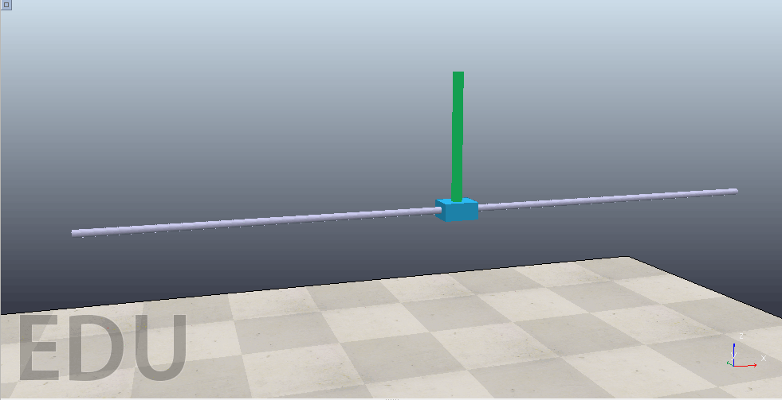

# CoppeliaSim + Gym + Stable-baseliines3

The basic workspace for reinforcement learning with CoppeliaSim simulation environments, including some demonstrated project for beginners. All the demos have been tested on Ubuntu 20.04, with Anaconda python environment.

---
## Environments setup

You have to install the following softwares and environments for this project, the recommend operating system is Ubuntu.
- CoppeliaSim 4.2 (https://www.coppeliarobotics.com/)
- Python 3.6+ (Anaconda is recommended)
- Gym (https://github.com/openai/gym)
- Stable-baselines3 (https://github.com/DLR-RM/stable-baselines3)
- Pytorch (https://pytorch.org/)
- Visdom (pip install visdom)

---
## Demo: Cart-pole control with the A2C (modified SAC) algorithm

- Step 1: run CoppeliaSim, import cartpole_scene.ttt
- Step 2: run visdom in your terminal, open your browser, and visit link: localhost:8097
- Step 3: run the script named 'coppeliasim_cart_pole.py' in the sub-path ‘./examples‘

Then we have:

