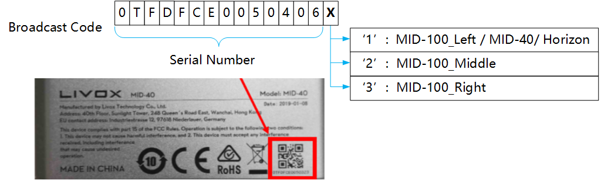

# Livox ROS Driver([览沃ROS驱动程序中文说明](https://github.com/Livox-SDK/livox_ros_driver/blob/master/README_CN.md))

livox_ros_driver is a new ROS package, specially used to connect LiDAR products produced by Livox. The driver can be run under ubuntu 14.04/16.04/18.04 operating system with ROS environment (indigo, kinetic, melodic) installed. Tested hardware platforms that can run livox_ros_driver include: Intel x86 cpu platforms, and some ARM64 hardware platforms (such as nvida TX2 / Xavier, etc.).

## 0. Version and Release History

### 0.1 Current Version

[v2.6.0](https://github.com/Livox-SDK/livox_ros_driver/releases)

### 0.2 Release History

[Release History](https://github.com/Livox-SDK/livox_ros_driver/releases)

## 1. Install dependencies

Before running livox_ros_driver, ROS and Livox-SDK must be installed.

### 1.1 ROS installation

For ROS installation, please refer to the ROS installation guide :

[ROS installation guide](https://www.ros.org/install/)

&ensp;&ensp;&ensp;&ensp;***Note :***

&ensp;&ensp;&ensp;&ensp;(1) Be sure to install the full version of ROS (ros-distro-desktop-full);

&ensp;&ensp;&ensp;&ensp;(2) There are 7 to 8 steps in ROS installation, please read the installation guide in detail;

### 1.2 Livox-SDK Installation

1. Download or clone [Livox-SDK](https://github.com/Livox-SDK/Livox-SDK) from Github to local;

2. Refer to the corresponding [README.md](https://github.com/Livox-SDK/Livox-SDK/blob/master/README.md) document to install and run Livox-SDK;

## 2. Get and build livox_ros_driver

1. Get livox_ros_driver from GitHub :

　　`git clone https://github.com/Livox-SDK/livox_ros_driver.git ws_livox/src`

&ensp;&ensp;&ensp;&ensp;***Note :***

&ensp;&ensp;&ensp;&ensp;Be sure to use the above command to clone the code to the local, otherwise it will compile error due to the file path problem.

2. Use the following command to build livox_ros_driver :

   ```bash
   cd ws_livox
   catkin_make
   ```

3. Use the following command to update the current ROS package environment :

&ensp;&ensp;&ensp;&ensp;`source ./devel/setup.sh`

## 3. Run livox_ros_driver

### 3.1 Use the ROS launch file to load livox_ros_driver

&ensp;&ensp;&ensp;&ensp;The command format is as follows :

&ensp;&ensp;&ensp;&ensp;`roslaunch livox_ros_driver [launch file] [param]`

1. If the [param] parameter is empty, livox_ros_driver will connect to the corresponding device according to the configuration in the configuration file. The connection rules are as follows :

&ensp;&ensp;&ensp;&ensp;&ensp;&ensp;When the connection status of the device specified in the configuration file is configured to enable connection (true), the livox_ros_driver will only connect to the device specified in the configuration file;

&ensp;&ensp;&ensp;&ensp;***Note :***

&ensp;&ensp;&ensp;&ensp;(1) the json configuration file is in the "ws_livox/src/livox_ros_driver/config" directory;

&ensp;&ensp;&ensp;&ensp;(2) When the connection status of the devices specified in the configuration file is all configured to prohibit connection (false), livox_ros_driver will automatically connect all the devices that are scanned;

2. If the [param] parameter is the broadcast code of LiDAR, take LiDAR (the broadcast code is 0TFDG3B006H2Z11) and LiDAR (the broadcast code is 1HDDG8M00100191) as an example, Use the  command as follows :

```bash
   roslaunch livox_ros_driver livox_lidar_rviz.launch bd_list:="0TFDG3B006H2Z11&1HDDG8M00100191"
```

&ensp;&ensp;&ensp;&ensp;***Broadcast code introduction***

&ensp;&ensp;&ensp;&ensp;Each Livox LiDAR device has a unique broadcast code. The broadcast code consists of a 14-character serial number and an additional character (1, 2, or 3), for a total of 15 characters. The above serial number is located under the QR code of the LiDAR body shell (see the figure below). The broadcast code is used to specify the LiDAR device to be connected. The detailed format is as follows :

&ensp;&ensp;&ensp;&ensp;

&ensp;&ensp;&ensp;&ensp;***Note :***

&ensp;&ensp;&ensp;&ensp;X in the figure above corresponds to 1 in MID-100_Left/MID-40/Horizon/Tele products, 2 in MID-100_Middle, and 3 in MID-100_Right.

## 4. Launch file and livox_ros_driver internal parameter configuration instructions

### 4.1 Launch file configuration instructions

All launch files of livox_ros_driver are in the "ws_livox/src/livox_ros_driver/launch" directory. Different launch files have different configuration parameter values and are used in different scenarios :

| launch file name          | Description                                                  |
| ------------------------- | ------------------------------------------------------------ |
| livox_lidar_rviz.launch   | Connect to Livox LiDAR device<br>Publish pointcloud2 format data<br>Autoload rviz |
| livox_hub_rviz.launch     | Connect to Livox Hub device<br>Publish pointcloud2 format data<br>Autoload rviz |
| livox_lidar.launch        | Connect to Livox LiDAR device<br>Publish pointcloud2 format data |
| livox_hub.launch          | Connect to Livox LiDAR device<br>Publish pointcloud2 format data |
| livox_lidar_msg.launch    | Connect to Livox LiDAR device<br>Publish livox customized pointcloud data |
| livox_hub_msg.launch      | Connect to Livox Hub device<br>Publish livox customized pointcloud data |
| lvx_to_rosbag.launch      | Convert lvx file to rosbag file<br>Convert lvx files to rosbag files directly |
| lvx_to_rosbag_rviz.launch | Convert lvx file to rosbag file<br>Read raw pointcloud data from lvx file and convert to pointcloud2 format for publishing |

#### 4.2 Livox_ros_driver internal main parameter configuration instructions

All internal parameters of Livox_ros_driver are in the launch file. Below are detailed descriptions of the three commonly used parameters :

| Parameter    | Detailed description                                         | Default |
| ------------ | ------------------------------------------------------------ | ------- |
| publish_freq | Set the frequency of point cloud publish <br>Floating-point data type, recommended values 5.0, 10.0, 20.0, 50.0, etc. | 10.0    |
| multi_topic  | If the LiDAR device has an independent topic to publish pointcloud data<br>0 -- All LiDAR devices use the same topic to publish pointcloud data<br>1 -- Each LiDAR device has its own topic to publish point cloud data | 0       |
| xfer_format  | Set pointcloud format<br>0 -- Livox pointcloud2(PointXYZRTL) pointcloud format<br>1 -- Livox customized pointcloud format<br>2 -- Standard pointcloud2 (pcl :: PointXYZI) pointcloud format in the PCL library | 0       |

&ensp;&ensp;&ensp;&ensp;***Livox_ros_driver pointcloud data detailed description :***

1. Livox pointcloud2 (PointXYZRTL) point cloud format, as follows :

```c
float32 x               # X axis, unit:m
float32 y               # Y axis, unit:m
float32 z               # Z axis, unit:m
float32 intensity         # the value is reflectivity, 0.0~255.0
uint8 tag               # livox tag
uint8 line              # laser number in lidar
```

2. Livox customized data package format, as follows :

```c
Header header             # ROS standard message header
uint64 timebase           # The time of first point
uint32 point_num          # Total number of pointclouds
uint8  lidar_id           # Lidar device id number
uint8[3]  rsvd            # Reserved use
CustomPoint[] points      # Pointcloud data
```

&ensp;&ensp;&ensp;&ensp;Customized Point Cloud (CustomPoint) format in the above customized data package :

```c
uint32 offset_time      # offset time relative to the base time
float32 x               # X axis, unit:m
float32 y               # Y axis, unit:m
float32 z               # Z axis, unit:m
uint8 reflectivity      # reflectivity, 0~255
uint8 tag               # livox tag
uint8 line              # laser number in lidar
```

1. The standard pointcloud2 (pcl :: PointXYZI)  format in the PCL library :

&ensp;&ensp;&ensp;&ensp;Please refer to the pcl :: PointXYZI data structure in the point_types.hpp file of the PCL library.

## 5. Configure LiDAR parameters

In the "ws_livox/src/livox_ros_driver/launch" path, there are two json files, livox_hub_config.json and livox_lidar_config.json.

1. When connecting directly to LiDAR, use the livox_lidar_config.json file to configure LiDAR parameters. Examples of file contents are as follows :

```json
{
   "lidar_config": [
      {
         "broadcast_code": "0TFDG3B006H2Z11",
         "enable_connect": true,
         "enable_fan": true,
         "return_mode": 0,
         "coordinate": 0,
         "imu_rate": 1,
         "extrinsic_parameter_source": 0
      }
   ]
}
```

&ensp;&ensp;&ensp;&ensp;The parameter attributes in the above json file are described in the following table :

LiDAR configuration parameter
| Parameter                  | Type    | Description                                                  | Default         |
| :------------------------- | ------- | ------------------------------------------------------------ | --------------- |
| broadcast_code             | String  | LiDAR broadcast code, 15 characters, consisting of a 14-character length serial number plus a character-length additional code | 0TFDG3B006H2Z11 |
| enable_connect             | Boolean | Whether to connect to this LiDAR<br>true -- Connect this LiDAR<br>false --Do not connect this LiDAR | false           |
| return_mode                | Int     | return mode<br>0 -- First single return mode<br>1 -- Strongest single return mode<br>2 -- Dual return mode | 0               |
| coordinate                 | Int     | Coordinate<br>0 -- Cartesian<br>1 -- Spherical               | 0               |
| imu_rate                   | Int     | Push frequency of IMU sensor data<br>0 -- stop push<br>1 -- 200 Hz<br>Others -- undefined, it will cause unpredictable behavior<br>Currently only Horizon supports this, MID serials do not support it | 0               |
| extrinsic_parameter_source | Int     | Whether to enable extrinsic parameter automatic compensation<br>0 -- Disable automatic compensation of LiDAR external reference<br>1 -- Automatic compensation of LiDAR external reference | 0               |

&ensp;&ensp;&ensp;&ensp;***Note :***

&ensp;&ensp;&ensp;&ensp;When connecting multiple LiDAR, if you want to use the external parameter automatic compensation function, you must first use the livox viewer to calibrate the external parameters and save them to LiDAR.

2. When connecting to the Hub, use livox_hub_config.json to configure the parameters of the Hub and LiDAR. Examples of file contents are as follows :

```json
{
   "hub_config": {
      "broadcast_code": "13UUG1R00400170",
      "enable_connect": true,
      "coordinate": 0
   },
   "lidar_config": [
      {
         "broadcast_code": "0TFDG3B006H2Z11",
         "return_mode": 0,
         "imu_rate": 1
      }
   ]
}
```

&ensp;&ensp;&ensp;&ensp;The main difference between the content of Hub json configuration file and the content of the LiDAR json configuration file is that the Hub configuration item "hub_config" is added, and the related configuration content of the Hub is shown in the following table :

HUB configuration parameter
| Parameter      | Type    | Description                                                  | Default         |
| -------------- | ------- | ------------------------------------------------------------ | --------------- |
| broadcast_code | String  | HUB broadcast code, 15 characters, consisting of a 14-character length serial number plus a character-length additional code | 13UUG1R00400170 |
| enable_connect | Boolean | Whether to connect to this Hub<br>true -- Connecting to this Hub means that all LiDAR data connected to this Hub will be received<br>false -- Prohibition of connection to this Hub means that all LiDAR data connected to this Hub will not be received | false           |
| coordinate     | Int     | Coordinate<br>0 -- Cartesian<br>1 -- Spherical             | 0               |

&ensp;&ensp;&ensp;&ensp;***Note :***

&ensp;&ensp;&ensp;&ensp;(1) The configuration parameters enable_connect and coordinate in the Hub configuration item "hub_config" are global and control the behavior of all LiDARs. Therefore, the LiDAR related configuration in the Hub json configuration file does not include these two contents.

&ensp;&ensp;&ensp;&ensp;(2) The Hub itself supports compensation of LiDAR external parameters, and does not require livox_ros_driver to compensate.

## 6. livox_ros_driver timestamp synchronization function

### 6.1 Hardware requirements

Prepare a GPS device to ensure that the GPS can output UTC time information in GPRMC/GNRMC format through the serial port or USB virtual serial port, and support PPS signal output; then connect the GPS serial port to the host running livox_ros_driver, and connect the GPS PPS signal line to LiDAR. For detailed connection instructions and more introduction to time stamp synchronization, please refer to the following links:

[Timestamp synchronization](https://github.com/Livox-SDK/Livox-SDK/wiki/Timestamp-Synchronization)

&ensp;&ensp;&ensp;&ensp;***Note :***

&ensp;&ensp;&ensp;&ensp;(1) The time stamp synchronization function of livox_ros_driver is based on the LidarSetUtcSyncTime interface of Livox-SDK, and only supports GPS synchronization, which is one of many synchronization methods of livox devices.

&ensp;&ensp;&ensp;&ensp;(2) Be sure to set the output frequency of GPRMC/GNRMC time information of GPS to 1Hz, other frequencies are not recommended.

&ensp;&ensp;&ensp;&ensp;(3) Examples of GPRMC/GNRMC format strings are as follows :

```bash
$GNRMC,143909.00,A,5107.0020216,N,11402.3294835,W,0.036,348.3,210307,0.0,E,A*31
$GNRMC,021225.00,A,3016.60101,N,12007.84214,E,0.011,,260420,,,A*67
$GPRMC,010101.130,A,3606.6834,N,12021.7778,E,0.0,238.3,010807,,,A*6C
$GPRMC,092927.000,A,2235.9058,N,11400.0518,E,0.000,74.11,151216,,D*49
$GPRMC,190430,A,4812.3038,S,07330.7690,W,3.7,3.8,090210,13.7,E,D*26
```

### 6.2 Enable timestamp synchronization

livox_ros_driver only supports the timestamp synchronization function when connected to LiDAR. The timestamp related configuration item timesync_config is in the livox_lidar_config.json file. The detailed configuration content is shown in the table below :

Timestamp synchronization function configuration instructions
| Parameter        | Type     | Description                                                  | Default        |
| ---------------- | -------- | ------------------------------------------------------------ | -------------- |
| enable_timesync  | Boolean  | Whether to enable the timestamp synchronization <br>true -- Enable timestamp synchronization<br>false -- Disable timestamp synchronization | false          |
| device_name      | String | Name of the serial device to be connected, take "/dev/ttyUSB0" as an example, indicating that the device sending timestamp information to livox_ros_driver is ttyUSB0 | "/dev/ttyUSB0" |
| comm_device_type | Int      | Type of device sending timestamp information<br>0 -- Serial port or USB virtual serial port device<br>other -- not support | 0              |
| baudrate_index   | Int      | Baud rate of serial device<br>0 -- 2400 <br>1 -- 4800 <br>2 -- 9600 <br>3 -- 19200 <br>4 -- 38400 <br>5 -- 57600 <br>6 -- 115200 <br>7 -- 230400 <br>8 -- 460800 <br>9 -- 500000 <br>10 -- 576000 <br>11 -- 921600 | 2              |
| parity_index     | Int      | parity type<br>0 -- 8bits data without parity<br>1 -- 7bits data 1bit even parity<br>2 -- 7bits data 1bit odd parity<br>3 -- 7bits data 1bit 0, without parity | 0              |

## 7. Convert lvx point cloud data file (v1.0/v1.1) to rosbag file

livox_ros_driver supports the conversion of lvx pointcloud data files to rosbag files. Use the command as follows :

`roslaunch livox_ros_driver lvx_to_rosbag.launch lvx_file_path:="/home/livox/test.lvx"`

After replacing "/home/livox/test.lvx" in the above command with the local lvx data file path, you can simply run it; if the conversion is successful, a rosbag format file with the same name will be generated under the above path.

## 8. Application Documents

* [How to use lvx file in ros](https://github.com/Livox-SDK/Livox-SDK/wiki/How-to-use-lvx-file-under-ros)
* [Set publish frequency](https://github.com/Livox-SDK/Livox-SDK/wiki/Set-publish-frequency)
* [外参标定与点云显示](https://github.com/Livox-SDK/Livox-SDK/wiki/Calibrate-extrinsic-and-display-under-ros-cn)

## 9. Support

You can get support from Livox with the following methods :

* Send email to cs@livoxtech.com with a clear description of your problem and your setup
* Report issue on github
