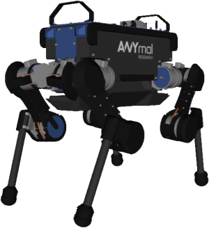

# ANYmal B Robot Description (URDF)
## Overview

This package contains a simplified robot description (URDF) of the [ANYmal B robot](https://www.anybotics.com/anymal) developed by [ANYbotics](https://www.anybotics.com).

The extended ANYmal B robot description, simulation, and control software is available exclusively to members of the [ANYmal Research community](https://www.anymal-research.org). For more information and membership applications, contact info@anybotics.com.

**Author & Maintainer: Linus Isler, [ANYbotics](https://www.anybotics.com)**

## License

This software is released under a [BSD 3-Clause license](LICENSE).

## Publications

If you use this work in an academic context, please cite the following publications:

> M. Hutter, C. Gehring, A. Lauber, F. Gunther, C. D. Bellicoso, V. Tsounis, P. Fankhauser, R. Diethelm, S. Bachmann, M. Bloesch, H. Kolvenbach, M. Bjelonic, L. Isler and K. Meyer
> **"ANYmal - toward legged robots for harsh environments“**,
> in Advanced Robotics, 31.17, 2017. ([DOI](https://doi.org/10.1080/01691864.2017.1378591))

    @article{anymal2017,
        title={ANYmal-toward legged robots for harsh environments},
        author={Hutter, Marco and Gehring, Christian and Lauber, Andreas and Gunther, Fabian and Bellicoso, Carmine Dario and Tsounis, Vassilios and Fankhauser, P{\'e}ter and Diethelm, Remo and Bachmann, Samuel and Bl{\"o}sch, Michael and Kolvenbach, Hendrik and Bjelonic, Marko and Isler, Linus and Meyer, Konrad},
        journal={Advanced Robotics},
        volume={31},
        number={17},
        pages={918--931},
        year={2017},
        publisher={Taylor \& Francis}
    }

> ANYbotics,
> **"ANYmal – Autonomous Legged Robot“**,
> [https://www.anybotics.com/anymal](https://www.anybotics.com/anymal) (accessed: 01.01.2019)

    @misc{anymal,
        author = {ANYbotics},
        title = {{ANYmal - Autonomous Legged Robot}},
        howpublished = {\url{https://www.anybotics.com/anymal}},
        note = {Accessed: 2019-01-01}
    }

## Usage

Load the ANYmal description to the ROS parameter server:

    roslaunch anymal_b_simple_description load.launch

To visualize and debug the robot description, start the standalone visualization (note that you have to provide the following additional dependencies: `joint_state_publisher`, `robot_state_publisher`, `rviz`):

    roslaunch anymal_b_simple_description standalone.launch

### Launch files

* **`load.launch`:** Loads the URDF to the parameter server. Meant to be included in higher level launch files.

* **`standalone.launch`:** A standalone launch file that starts RViz and a joint state publisher to debug the description.
